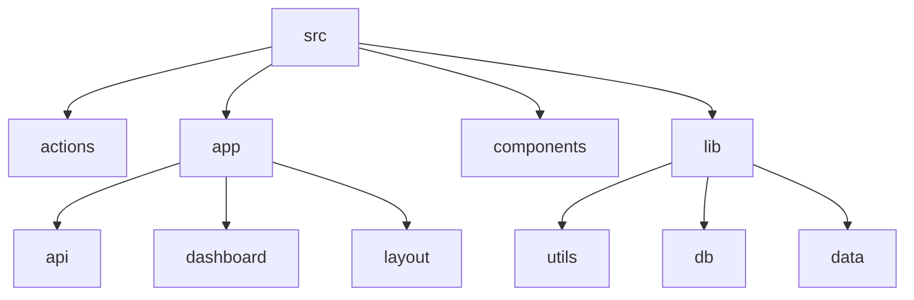

# Birthday Reminder

## 🗂️ Description

The bday-reminder repository is a birthday reminder application built with Next.js, Prisma, and Clerk. This project allows users to manage birthday reminders, generate AI-powered birthday wishes, and send automated emails to friends and users. The application features a user dashboard for adding, editing, and deleting birthday reminders, as well as a landing page with a hero section, features grid, and testimonials.

The application uses Clerk for authentication and authorization, ensuring that only authorized users can access and manage their birthday reminders. The project also utilizes Prisma to interact with a MongoDB database, storing birthday reminder data and user information.

## ✨ Key Features

### **User Management**

* User authentication and authorization with Clerk
* User dashboard for managing birthday reminders

### **Birthday Reminders**

* Add, edit, and delete birthday reminders
* Display upcoming birthdays in a table format
* Generate AI-powered birthday wishes
* Receive notifications for upcoming birthdays
* View a list of all saved birthdays

### **Email Functionality**

* Automated email sending to friends and users on birthdays
* Customizable email templates

### **AI-powered Features**

* Generate birthday wishes using Google Gemini model

## 🗂️ Folder Structure

## 🛠️ Tech Stack

* Next.js
* Prisma
* Clerk
* React
* Tailwind CSS
* Google Gemini (AI library)
* Resend (email library)
* @react-email/components (email templates)

## ⚙️ Setup Instructions

To run the project locally:

* Git clone the repository: https://github.com/abhraneeldhar7/bday-reminder.git
* Install dependencies: `npm install` or `yarn install`
* Set up environment variables:
+ Clerk API keys
+ Prisma database URL
+ Resend email API keys
* Run the application: `npm run dev` or `yarn dev`
* Access the application at http://localhost:3000

## Contributing

To contribute to the project, please fork the repository and submit a pull request with your changes.
