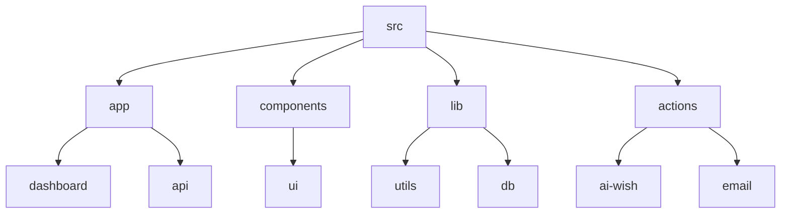
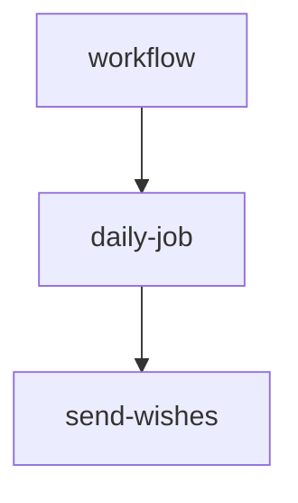

# Birthday Reminder App 🎉

## 🗂️ Description

The Birthday Reminder App is a full-stack application designed to help users keep track of their friends' and family members' birthdays. The app allows users to add birthday reminders, generate AI-powered birthday wishes, and send automated email reminders. This project is perfect for developers looking for a comprehensive example of a real-world application built with Next.js, TypeScript, and Prisma.

The app is built with a focus on user experience, featuring a clean and intuitive interface, and is optimized for performance and scalability.

## ✨ Key Features

### Core Features

* **Birthday Reminder Management**: Add, edit, and delete birthday reminders with details such as name, birthday, email, and relationship.
* **AI-Powered Birthday Wishes**: Generate personalized birthday wishes using AI models.
* **Automated Email Reminders**: Send automated email reminders to users and their friends on birthdays.

### User Interface

* **Dashboard**: A user-friendly dashboard to view and manage birthday reminders, with features such as upcoming birthdays, this month's birthdays, and next month's birthdays.
* **Form Components**: Intuitive form components for adding and editing birthday reminders.

## 🗂️ Folder Structure

## 🛠️ Tech Stack

## ⚙️ Setup Instructions

To run the project locally, follow these steps:

* Git clone the repository: `git clone https://github.com/Xeven777/bday-reminder.git`
* Install dependencies: `npm install`
* Start the development server: `npm run dev`

## 🤖 GitHub Actions

The project uses GitHub Actions to automate the process of sending birthday wishes. The workflow is defined in the `.github/workflows/actions.yml` file.

## 📝 Configuration Files

The project uses several configuration files, including:

* `.eslintrc.json`: ESLint configuration file that extends the Next.js core web vitals configuration.
* `.vscode/settings.json`: Visual Studio Code settings file with a single setting for Next.js.
* `postcss.config.mjs`: PostCSS configuration file that uses the Tailwind CSS plugin.
* `next.config.mjs`: Next.js configuration file that enables PWA support with custom settings.
* `prisma/schema.prisma`: Prisma schema file that defines the database model for the application.
* `tsconfig.json`: TypeScript configuration file that sets up the compiler options for the project.

  

<h3>Anish</h3>

Passionate developer with a love for problem-solving, efficient and creative thinking.

 

  <a href="https://gitfull.vercel.app">Made by GitFull</a>

    